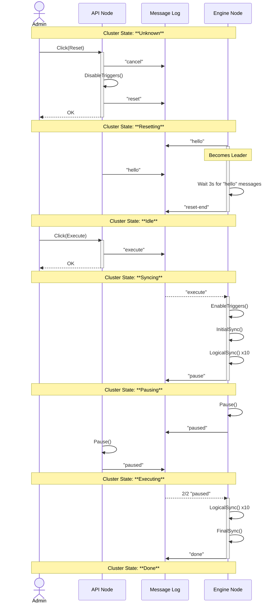

# SWO Group

The `swogrp` package handles orchestrating the state and transitions of the SWO process. The state of the cluster can be determined by following the sequence in the message log, which is the source of truth.

## Cluster State

